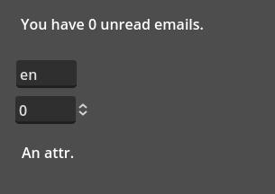

# Godot Fluent Translation


[Fluent](https://projectfluent.org/fluent/guide/) Translation for Godot via a [Rust](https://github.com/projectfluent/fluent-rs) [GDExtension](https://github.com/godot-rust/gdext).



## Available Versions

**If you simply wish to download and install this extension, keep reading.**

If you are a developer and wish to build this extension yourself (e.g. to use a specific Godot version), go to [BUILDING](./BUILDING.md) to learn more about your choices.

Releases are currently only available for **Windows**, but other platforms can be self-compiled.

This extension can be downloaded in two different versions, each with their own benefits and downsides:

### Default

- Works with official releases of [Godot v4.3 dev 6](https://godotengine.org/article/dev-snapshot-godot-4-3-dev-6/) or newer.
- Has some limitations
    - Translations that use variables are written like `tr(TranslationFluent.args("message", { ... }))`
        - Requires [`internationalization/fluent/parse_args_in_message`](#project-settings) to be enabled.
    - Translation files must be loaded via code, not via Project Settings.

### Forked

- Requires a special custom ("forked") version of Godot, included as a separate download (see installation instructions). It might not be updated very frequently.
- Better engine integration
    - Translations that use variables can be written like `tr("message", { ... })`
    - Translation files can be loaded via code or via Project Settings.

### Why two versions?

Due to Godot's translation system being very inflexible, it is not possible for an extension to modify certain parts about it.
While I'd love for all features to work with the official version of Godot, it is unlikely for [all of my changes](https://github.com/RedMser/godot-fluent-translation/issues/11) to be included in any upcoming version.

This is why you have the choice between a version that has better engine support, or one that "just works".

## Installation

- Decide which extension version you want to use (see above).
- Download the corresponding [zip release](https://github.com/RedMser/godot-fluent-translation/releases) for your platform and version.
- Extract the zip file contents to your project folder.
- Download a compatible version of Godot.
    - **Default**: [Godot v4.3 dev 6](https://godotengine.org/article/dev-snapshot-godot-4-3-dev-6/) or newer.
    - **Forked**: [Download forked builds here.](https://github.com/RedMser/godot/releases)
- Start Godot editor. If it was already running, restart it to fix autocompletion.
- Follow the sample code to see if installation was successful. Remove any code which contains errors, depending on the version you've installed.
    - You can also try the sample project in the `godot` folder of this repository.

## Code Sample

```gd
func _init():
    # Four ways to load FTL translations:
    # 1. load(path) with locale in file name (Portuguese).
    var tr_filename = load("res://test.pt_PT.ftl")

    # 2. load(path) with locale in folder name (German).
    var tr_foldername = load("res://de/german-test.ftl")

    # 3. Manually create a TranslationFluent resource.
    var tr_inline = TranslationFluent.new()
    # Ensure that you fill the locale before adding any contents (English).
    tr_inline.locale = "en"

    # 4. Forked only - [Project Settings -> Localization -> Translations] and add a .ftl file there.
    # You may need to change the file filter to "All Files" to see .ftl files in the file selector dialog.

    # Godot automatically converts spaces to tabs for multi-line strings, but tabs are invalid in
    # FTL syntax. So convert tabs to four spaces. Returns an error that you should handle.
    var err_inline = tr_inline.add_bundle_from_text("""
-term = email
HELLO =
    { $unreadEmails ->
        [one] You have one unread { -term }.
       *[other] You have { $unreadEmails } unread { -term }s.
    }
    .meta = An attr.
""".replace("\t", "    "))

    # Register via TranslationServer.
    TranslationServer.add_translation(tr_filename)
    TranslationServer.add_translation(tr_foldername)
    TranslationServer.add_translation(tr_inline)


func _notification(what: int) -> void:
    if what == NOTIFICATION_TRANSLATION_CHANGED:
        # Fluent supports $variables, which can be filled when translating a message.

        # Default version: use a wrapper function to pass arguments:
        $Label.text = atr(TranslationFluent.args("HELLO", { "unreadEmails": $SpinBox.value }))

        # Forked version: pass arguments directly to tr() and friends:
        $Label.text = atr("HELLO", { "unreadEmails": $SpinBox.value })

        # The context field is used to retrieve .attributes of a message.
        $Label2.text = atr("HELLO", "meta") # Default
        $Label2.text = atr("HELLO", {}, "meta") # Forked
```

## Project Settings

* `internationalization/fluent/parse_args_in_message`: Decides whether variables can be filled via the message parameter. This is the only way to pass args when using the [Default](#default) version, so only makes sense to use in that case.
* `internationalization/fluent/locale_by_file_regex`: If specified, file name is first checked for locale via regex. Can contain a capture group which matches a possible locale. Always case-insensitive.
* `internationalization/fluent/locale_by_folder_regex`: If specified, the folder hierarchy is secondly traversed to check for locale via regex. Can contain a capture group which matches a possible locale. Always case-insensitive.
* `internationalization/fluent/generator/locales`: See below.
* `internationalization/fluent/generator/file_patterns`: See below.
* `internationalization/fluent/generator/invalid_message_handling`: If a message identifier is invalid (e.g. contains symbols or spaces), should it be skipped or should the invalid symbols be replaced with underscores?
* `internationalization/locale/fallback`: Fallback locale is used when the selected language does not have a date/time/number formatter available.

> [!TIP]
> If you don't see some of these settings, make sure you have Advanced Settings showing.

## FTL Generator

You can automatically extract message IDs from your scene files!

1. Edit the `internationalization/fluent/generator/locales` project setting to define a list of locales to generate.
2. Edit the `internationalization/fluent/generator/file_patterns` project setting to define how files should be generated:
    - Both the key and the value should be type String.
    - The key represents a regular expression to locale a set of source files. For example `(.+)\.tscn` would find all scene files in your project.
        - Note that capture groups can be used later, so make sure to make good use of non-capturing groups to ensure your group indices are consistent.
    - The value represents the path to the generated FTL file. It can contain placeholders that get replaced:
        - `{$locale}` is replaced with each of the locales listed in the `locales` project setting (creating multiple files).
        - `{$n}` is replaced with the n-th capture group (so `{$1}` would contain the first capture group that matched).
        - For example, with the above regex, `res://i18n/{$1}.{$locale}.ftl` would create files like `i18n/my_scene.en.ftl` in your project root.
    - If a FTL file already exists (or is matched multiple times, e.g. by different patterns), it will be merged with the existing file. No messages are ever deleted, and existing messages will remain untouched.
3. Run the generator by creating a tool script such as this one:

```gd
@tool
extends EditorScript

func _run() -> void:
    var generator = FluentGenerator.create()
    generator.generate()
```

> [!TIP]
> To run an `EditorScript`, open it in the script editor and go to `File -> Run`.

This system provides maximal flexibility and very little maintenance once set up properly.

Currently, only `.tscn` files are properly handled (similarly to the POT generator feature built into Godot).
A plug-in system to customize message extraction is planned but currently not possible to implement.

## About this Project

This is not a production-ready project and will likely have breaking API changes without warning. Please consider this if you intend on using this library.

Due to Godot needing breaking API changes to have this extension work, it is unlikely to become easily usable out-of-the-box. Not much I can do besides wait for another major release that would accept this breaking change.

Any help in continuing development for this library is welcome!
